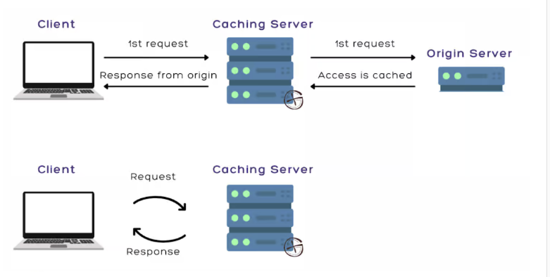
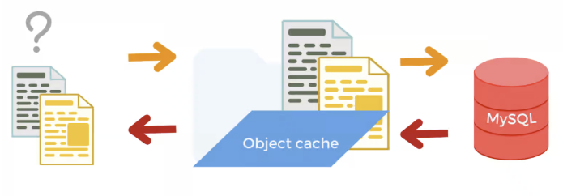
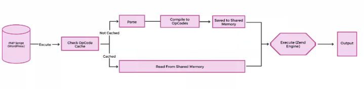
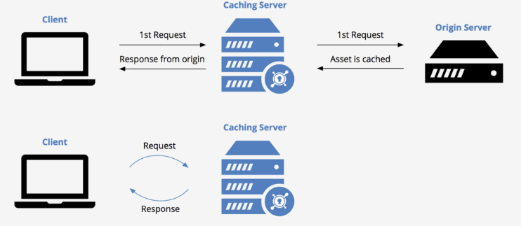

# [day14] Cache
### Server side cache
Server side cache服務器端緩存將Web文件和數據臨時存儲在源服務器上以供以後重用

缺點: 
* 服務器端緩存的主要問題是延遲。延遲可以定義為數據包從源到目的地的總時間。高延遲意味著顯著延遲用戶的請求和服務器的響應。

#### Types of Server-side Caching
* Object Caching: database資料可以儲存在這裡進行緩存

* Opcode Caching: 可以為PHP的性能進行加強

* CDN Caching: CDN緩存可以儲存在cache上

### Client side cache
Client side cache將Web文件和數據臨時存儲在瀏覽器內存中，而不是保存在服務器中。
缺點:
* 缺點為資料在特定瀏覽器的，使用多個瀏覽器，同一網頁會有多個緩存文件。
* 客戶端緩存的另一個缺點是它比服務器端緩存更複雜。

## 參考
* https://www.codingninjas.com/codestudio/library/server-side-caching-and-client-side-caching
