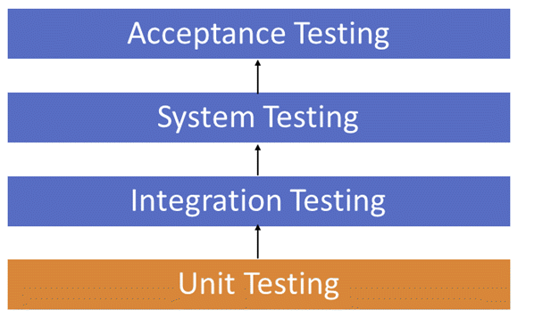

# [day17] Unit test相關知識
測試從從小到大排序如下

## Integration Testing
### Big Bang Testing (大爆炸測試)
所有組件及成後一起測試，缺點為因為組件都集成後才測試，不好debug，並且容易漏掉某些接口的測試

### Bottom-up Integration Testing
由下到上的測試集成，優點為debug容易、可以在程式設計早期就開始進行測試，缺點為如果系統設計如果有問題修改起來就不方便

### Top-down Integration Testing
由上往下的測試集成，優點為debug容易，整體模塊可以優先被測試到，可以先發現設計上的缺陷，在早前先行調整，缺點為較低級別的模塊測試不充分。

### Sandwich Testing
同時由下往上和由上往下進行測試，優點為集成上述的優點，缺點為中間層選擇不適當會造成開發設計上負擔

## Unit Testing
針對單個function測試，優點為在之後重構代碼後，經由測試可以快速知道unit是否正確被改寫，缺點為因為是針對unit測試，因此無法得知整個system運行結果
### Unit Testing 常用測試工具
* Selenium: 流行的開源功能測試工具
* QTP: 非常用戶友好的 HP 功能測試工具
* JUnit: 主要用於Java應用程序，可用於單元和系統測試
* soapUI: 這是一個開源的功能測試工具，主要用於Web服務測試。它支持多種協議，例如 HTTP、SOAP 和 JDBC
* Watir: 這是一個用於 Web 應用程序的功能測試工具。它支持在 Web 瀏覽器上執行的測試並使用ruby腳本語言

## Functional Testing
針對程式進行功能性測試，以下列出常用來進行的功能性測試，有些無法進行功能性測試如壓力測試等等
|Functional testing|Non-functional testing|
|---|---|
|Unit Testing|Performance Testing|
|Smoke Testing|Load Testing|
|Sanity Testing|Volume Testing|
|Integration Testing|Stress Testing|
|White box testing|Security Testing|
|Black Box testing|Installation Testing|
|User Acceptance testing|Penetration Testing|
|Regression Testing|Compatibility Testing|
||Migration Testing|

## 參考
* https://www.guru99.com/functional-testing.html
* https://www.guru99.com/integration-testing.html
* https://www.guru99.com/unit-testing-guide.html
