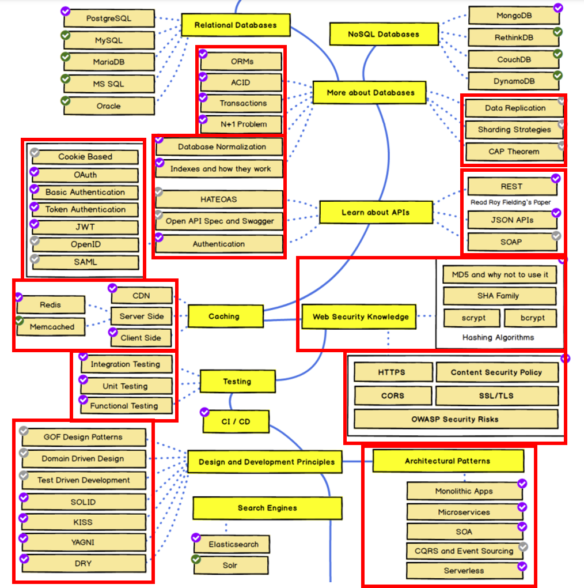
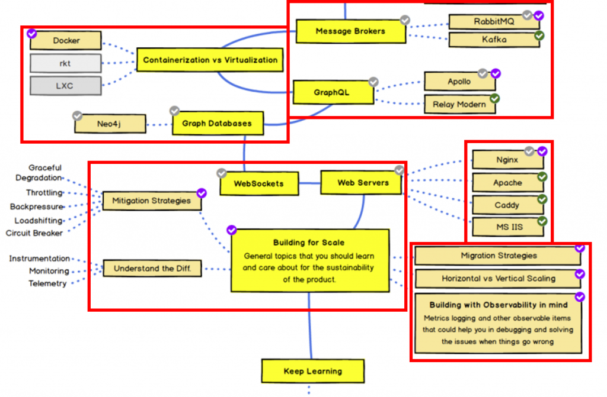

# [day1] Foreword

主要想要在backend領域上更為深入，平常會使用到一些backend技術但常常知其然而不知其所以然，因此想要在技術底層札得更穩一些，因此這次的學習計劃打算follow roadmap https://roadmap.sh/backend 從基礎處的知識觀念開始撰寫了解，規劃了每日進度方塊，接下來這30天會這個如下圖的進度去完成，每次會完成一個紅框區塊的study並撰寫成技術文章，如果內容偏多會拆分成兩天去撰寫，以下為初步規劃，接下來就開始30天的鐵人競賽吧!!!

---

---

