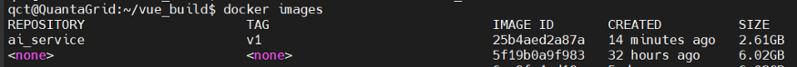

# [day22] docker使用command
## Docker 查詢相關指令
### 查看所有 docker images
```
docker images
```

### 查看運行中的 docker
```
docker ps
```

### 查看所有的 docker (包括停止狀態的docker)
```
docker ps -a
```

### 查看docker網路配置
```
docker network ls
```


當使用 container 設定成bridge時，網路是private，再啟動container時通過-p開protocol與外面相通。
當使用 container 設定成 host 時，Docker 會與 host 共享網路資源，但檔案系統依然是分開獨立的。
兩個container要互相溝通的話要共享網路，先創立一個bridge 後再將兩個container掛在同一個bridge上即可達到網路互通。

### 查看 docker 網路資訊
```
docker network inspect [NETWORK NAME]
```

### 查看 docker 佔用 resource
```
docker stats
```

[CONTAINER]：Container ID
[CPU %]：CPU 的使用率
[MEM USAGE / LIMIT]：當前使用的內存和最大可以使用的内存
[MEM %]：當前內存的使用率
[NET I/O]：網路I/O
[BLOCK I/O]：磁碟I/O
[PIDS]：PID


### 查看指定 docker 佔的 resource
```
docker stats <container id>
```

## Docker Runtime 相關指令

### create 共享的 bridge
```
docker network create ai_platform
```


### Run container
**[args]:**
-v: 將 container 掛上 host 的 volumn
-p: 將 container port 映射至 host port
--name: container 名稱
--net: 掛載 conatiner 網段
--shm-size: 設定 share memory 大小(預設為64M)
--gpus all: 在 container 中使用 gpu

```
docker run -it --name <container name> --net ai_platform -v /home/qct/AI_platform/storage:/storage --shm-size 8G -p 5000:5000 --gpus all ubuntu:18.04 bash
```

### Build container with dockerfile
```
docker build -t tensorrtimg02:dev01 . — no-cache
```


Dockerfile 內容如下


### 從 docker 裡轉發 X11 GUI
```
docker run -it  --rm -v /home/qct/AI_platform/storage:/storage -e DISPLAY=$DISPLAY -v $HOME/.Xauthority:/root/.Xauthority  --network=host --shm-size 8G  --gpus all qctuser/backend-tensorrtyolo bash
```

### start container
```
docker start <container id>
```

### Enter container shell
```
docker exec -it <container id> bash
```

### stop container
```
docker start <container id>
```
### remove container
```
docker rm <container id>
```
### remove docker image
```
docker image rm <image id>
```

### Commit container to images
```
docker commit <container id> ai_service:v1
```
