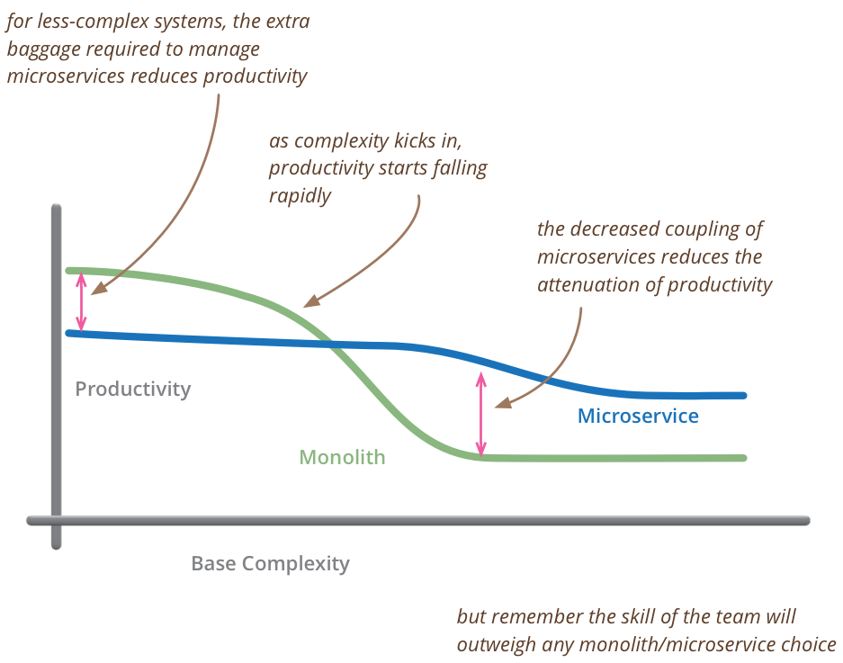
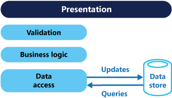
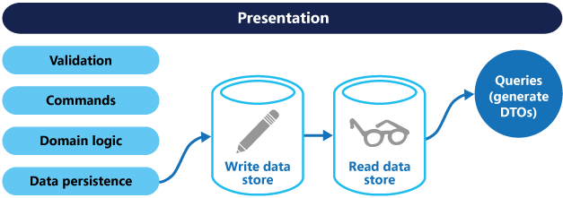

# [day24] service相關知識
### Monolithic application
指設計程式時沒有考慮模組化的程式，在寫程式時應該考慮模組化的概念，使應用可以付用程式中某一部分，在未來要復用程式時，可以只改某一區塊，不需要大量變動程式，其特性為servie會有許多component所組成，而這些component通常都是由同一種程式語言，或是同一支程式所控管，因此在修改程式時，會需要將整個服務重新啟動。

### Microservices 
為了將上述component模組化而出現的microservice，可以將service內中component拆成更細小的microservice，例如: 下載圖片服務、壓縮檔案、傳送資料。

Microservices將資料儲存去中心化。通常每個服務都會有自己的資料庫，可以是同一個資料庫結構的不同實例，也可以是完全不同的資料庫系統。

如下圖可以看到，在大多數情況下單一服務是比較適合的架構，但是當服務量到非常大單一架構維護困難時，才會需要使用到microservice架構，要精準設計microservice架構會相當花費心力。

(取自 https://martinfowler.com/bliki/images/microservice-verdict/productivity.png)

### cors (Command Queries Responsibility Segregation)
在傳統數據庫處理上，通常會對單一數據庫使用CRUD，但當數據資料量大時，單一數據庫會遇到效能問題，以及mysql排他鎖、阻塞sql。

cors架構下將讀寫進行分離，讀寫可以使用不同資料庫，讀取的資料庫可以使用nosql去提升查詢的性能，在寫入的同時執行同步command，但能然會有資料不同步的問題。

### Serverless
Serverless是一個基於FaaS(Function as a Service)的服務，在程式代碼打好用直接將web程式和yaml設定好後，直接使用aws雲服務，其會在後台直接佈署好web service，省去自己架設service時需要設定domain、預防攻擊等等複雜工作，因此對於開發史來說屬於看不見的service因此叫做serverless，但實際是由aws雲端去運維這些服務

## 參考
* https://ithelp.ithome.com.tw/articles/10228330
* https://ithelp.ithome.com.tw/articles/10273154
* https://microservices.io/patterns/microservices.html
* https://segmentfault.com/a/1190000039653944
* https://ithelp.ithome.com.tw/articles/10213431