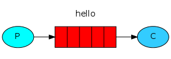
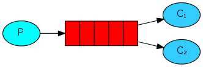
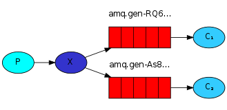
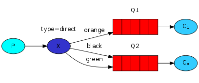
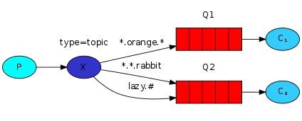
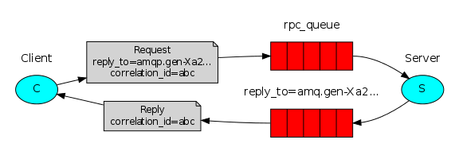

Message broker是作為應用程式與應用程式之間的模塊，用來交換訊息，其運作方式會有一個publisher和consumer，publisher會將訊息進行傳遞出來，而consumer會去訂閱訊息，如此一來雙方互相不需要知道彼此的ip位置，如database的概念，其優點為將訊息儲存在message queue裡面，不會因為應用程式crash導致訊息消失。

### RabbitMQ
RabbitMQ中重要的名詞有
* Produccer: 負責將訊息丟入Queue中
* Consumer: 負責接收來自Queue的訊息
* Queue: 儲存資料的位置，有先進先出(FIFO)的特性
* Exchange: Prodecer透過exchange來決定要丟給哪一個queue
* Binding: 用來通知exchange其可以管理那些queue

Task Queue: 不透過 Exchange 直接送到指定的 Queue

Publish/Subscribe: 透過 Exchange 的 fanout 特性，達到訂閱 Queue 的 Consumer 都可以收到訊息。

Routing: 透過 Exchange 的 direct 特性，達到類似 routing 的功能，將訊息 filter 到特定的 Queue。

Topics: 透過 Exchange 的 topic 特性，每個 Queue 都有屬於自己的分類。

RPC: 如果需要回傳訊息的話則需要透過 RPC。

### Kafka
Kafka 是一個分散式訊息引擎與流處理平臺 (大數據管理 tool)，經常用做企業的訊息匯流排、實時資料管道，可以將其當做儲存系統來使用，其系統架構具有許多優點。

高吞吐、低延時：這是 Kafka 顯著的特點，Kafka 能夠達到百萬級的訊息吞吐量，延遲可達毫秒級。
持久化儲存：Kafka 的訊息最終持久化儲存在磁碟之上，提供了順序讀寫以保證效能，並且通過 Kafka 的副本機制 (replicaset) 提高了資料可靠性。
分散式可擴充套件：Kafka 的資料是分散式儲存在不同 broker 節點的，以 topic 組織資料並且按 partition 進行分散式儲存，整體的擴充套件性都非常好。
高容錯性：叢集中任意一個 broker 節點當機，Kafka 仍能對外提供服務。

#### Kafka架構
kafka 組件 broker 由數個 Topic 組成，一個 Topic 由數個 partition 組成

#### kafka中重要的名詞有
* Producer(生產者): 為向 broker 中寫入訊息的腳色，回選擇要從哪一個 Topic 中寫入訊息
* Consumer(消費者): 為向 broker 中訂閱者的服務，向消費者釋出訊息，消費者可以組成 Consumer Group ，此時 Broker 只會向 Consumer Group 釋放一次訊息
* Broker: Kafka 通常以 cluster 的方式建置，多個 broker 組成一個 kafka cluster，每一個 broker 就是一個伺服器。
* Topic: broker 由數個 partition 組成，以 database 的觀念來看，其類似 table 的概念。
* message: kafka 儲存資料的地方，每一條訊息由一個 key, value, timestamp 所組成。
* offset: message 儲存位置類似 dict 中 index 的概念，如儲存資料時沒有指定 key value，則假設本次訊息的 offset 為 N，下一次訊息儲存 offset 為 n+1。

## 參考
* https://godleon.github.io/blog/ChatOps/message-queue-concepts/
* https://zamhuang.medium.com/rabbitmq-%E4%BA%94%E5%88%86%E9%90%98%E8%BC%95%E9%AC%86%E4%BA%86%E8%A7%A3-rabbitmq-%E9%81%8B%E4%BD%9C-fcaecbaa69d4
* https://ithelp.ithome.com.tw/articles/10239223
* https://hackmd.io/CuwpT8g3R_2kgsnCm0aIOQ