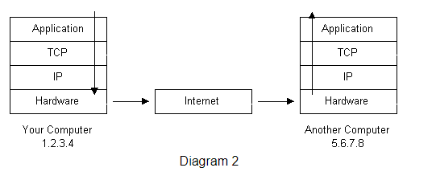
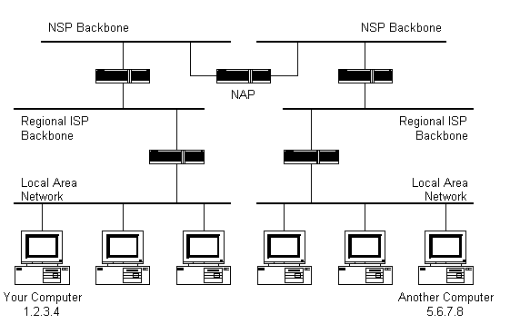
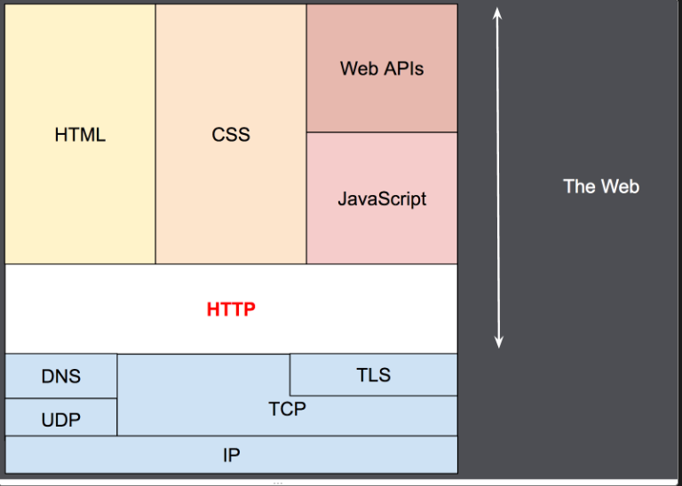
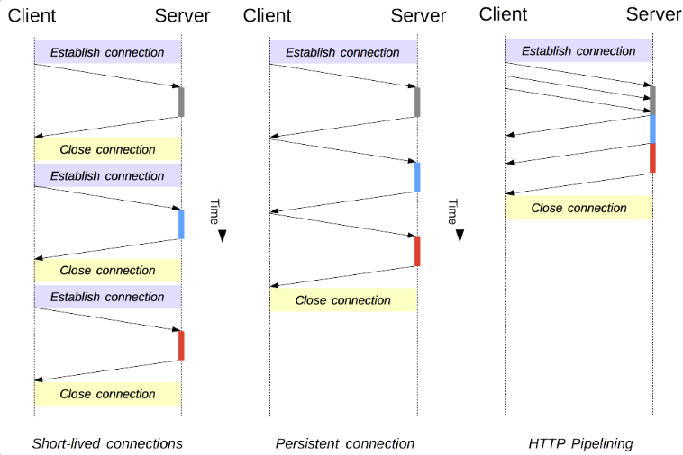
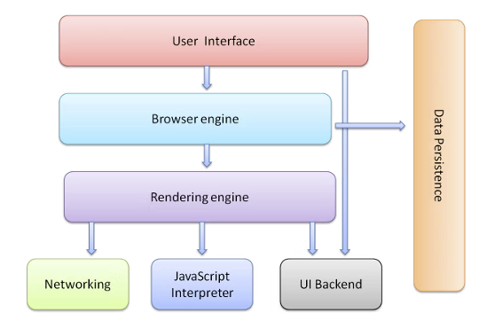

# [day2] Web底層網路相關知識補給(http, web component)

## network
network相關知識
### ssl(Secure Sockets Layer) 
是一系列的加密技術，網址旁有鎖代表uer跟該網站的已加密，通過ssl只有user跟網站知道如何解碼訊息，第三方監聽只會得到一連串隨機的string而無法得知破譯方法。

### Protocol Stacks and Packets
a電腦ip(1.2.3.4)傳送packet到b電腦ip(5.6.7.8)，其資料傳輸過程為如下圖箭頭所示。

|Protocol Layer|Description|
|---|---|
|Application Protocol Layer|應用層ex: email, FTP|
|Transmission Control Protocol Layer|將packet透過portocol傳輸|
|Internet Control Protocol Layer|將packet透過ip傳輸|
|Hardware Layer|將傳輸資料轉換成電路信號|

#### 封包傳送detail
當packet傳輸到router時，router會檢查自己是否知道此ip位置在哪，如果不知道default會向上一層傳送資料，讓上一層繼續查找ip位置

### http 總攬
http設計於1990年代初期，是通過TCP與TLS發展而成的應用層協議(Application Protocol Layer)

常見的http包含:
1. http version: `http/1`, `http/1.1`, `http/2.0`
2. method: `get`, `post`, `put`, `delete`, `patch`
2. header: `application/json`
3. body: `body`
4. url: `http://ip:port`

    
#### web client
當用戶端要開啟網站會發送一個原始請求來獲取該頁頁面的html、css、圖像、影片等等，網頁內通常會有超聯結，點擊超連結會將需求轉換為相對應http的request，而後response相對應內容回來。

#### web Server
根據用戶請求response相對應資料回覆給用戶

#### proxy 
web client和web server會透過http進行資料傳遞，中間通常會有一個到數個proxy節點，加入proxy好處有:
- caching: 緩存public、private資料，像是緩存browser chache 
- load balancing: 平衡server負載，將requests分配到多個server上
- filter: 過濾攻擊病毒等等
- authentication: 對於request進行驗證是否有權限
- logging: 記錄歷史訊息

#### http/1.0
早期release的http版本，其特色為在每次連線時都會建立一次TCP連線，TCP連線需要握手三次才能發送消息，在送出請求後TCP連線的port會release掉，因此在發起多個requests的時候會造成大量的連線而造成效能的瓶頸。
#### http/1.1
新增method包含`PUT`,`PATCH`,`OPTIONS`,`DELETE`，並且解決在http/1.0的效能問題，即為建立持久連線，默認狀態部會release掉TCP的portocol，在建立連線結束用戶端需發送一個header為`Connection: close`來關閉連接。

##### HTTP pipelining: 
http的處理為request出去後，伺服器端response回來再發送新的請求，再http pipelining中可以不理會response多次發送request出去，僅限於idempotent methods像是`GET`,`PUT`,`DELETE`，再request失敗後可以重複再發送請求不影響結果。

#### http/2.0
優化內容:
1. 通過同一個TCP連線傳送多個異步(asynchronous)的請求
1. 支援header壓縮，將重複的header key壓縮成1~2bytes減少傳輸大小
2. body以二進制進行壓縮比text更有效率
3. 傳統上會先取得html，再根據html網址去request對應的css,javascript，server主動將web內容(html, css, javascript)發送給user

8. http3

### web browser
下圖為web browser渲染器，其主要的component有
1. User Interface: 使用者UI介面
2. Browser engine: UI and the rendering engine
3. Rendering engine: 負責解析渲染的內容包括html與css，將其渲染在web上，不同的web browser使用不同的渲染引擎，Internet Explorer使用Trident、Fire Fox使用Gecko、Safari使用Webkit、Chrome和Opera使用Blink(Webkit分支)。
4. Networking: 負責http的調用
5. Javascript Interpreter: 負責解析javascript code
6. UI Backend: 用來繪製小型基礎物件
7. Data storage: 支援儲存data到本地如: localStorage, IndexedDB, WebSQL and FileSystem

https://developer.mozilla.org/zh-CN/docs/Web/HTTP/Connection_management_in_HTTP_1.x
