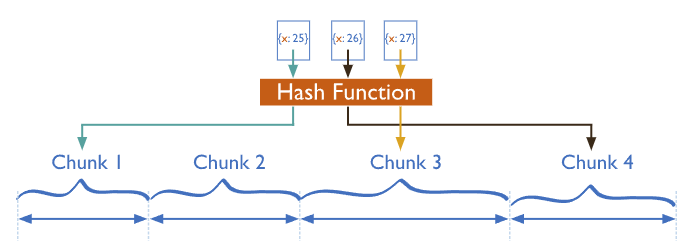
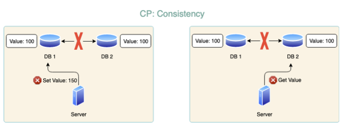
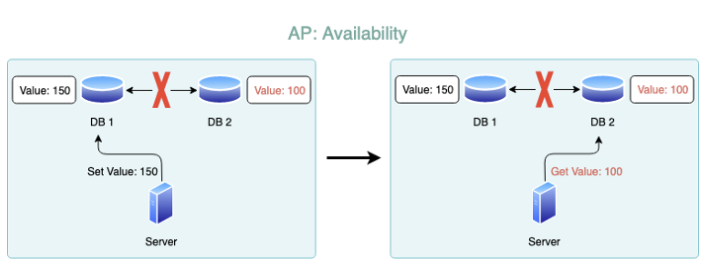

# [day8] 分散式系統相關
### database replication
備份資料到不同的機器上，server壞掉才有備份檔案使用，將雞蛋放在不同的籃子裡，以及當使用者非常多的時候如果都讀取同一個資料庫很快就會遇到效能瓶頸，優點為從多個資料庫讀取資料可以將達成分散式系統增加使用體驗，但是缺點可能會遇到資料庫不同步的問題

### Sharding strategy
shading主要在資料量多時，將資料表切片放在不同的server上達成分散式的概念，在分表上有垂直切分和水平切分，在分片架構上理論由hash function，然後將使用者的請求平均分散至各台server上

#### 垂直切分
垂直切分為將資料庫，以table為單位切分資料

#### 水平切分
水平切分為將資料庫拆分成更多細小碎塊，水平切分出來

### CAP Theorem
分散式系統不可能達成下列三點，CAP是下列三個單字的首字縮寫：
* 一致性（Consistency）: 無法所有的使用者query到的資料都是一致的
* 可用性（Availability）: 使用者獲取資料或的保障，A資料庫死掉會轉向B資料庫要資料
* 分區容錯性（Partition tolerance）: 在傳輸過程資料遺失，系統仍然要可以正常繼續運作

如果系統要保持CP，則系統在更新資料時，使用者請求資料則去拒絕連線，會犧牲使用者體驗

但如果要保持AP，使用者請求資料則去會回復資料，但是不能保證數據庫內容一致

## 參考
* https://medium.com/%E5%BE%8C%E7%AB%AF%E6%96%B0%E6%89%8B%E6%9D%91/cap%E5%AE%9A%E7%90%86101-3fdd10e0b9a
* https://zh.m.wikipedia.org/zh-hant/CAP%E5%AE%9A%E7%90%86
* https://www.manageengine.com/device-control/data-replication.html
* https://mongoing.com/docs/core/sharding-introduction.html
* https://blog.csdn.net/YILONGC/article/details/96479172
